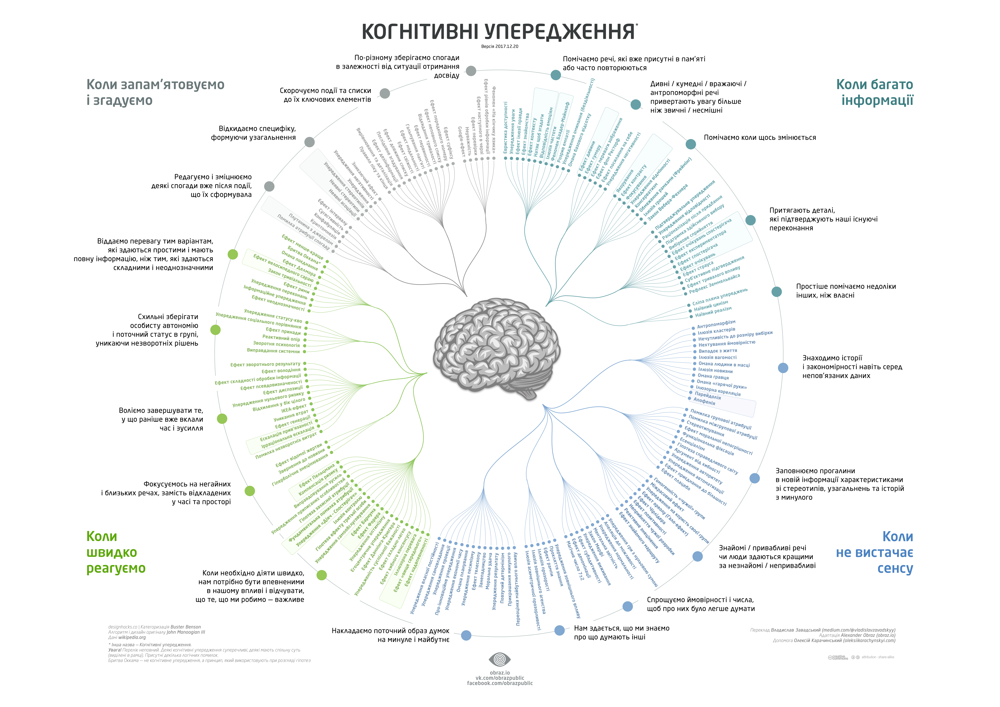

# Human Behavior

## Links
- [Catalogue of Bias](https://catalogofbias.org/biases/)
- [Individual differences in cognitive biases](https://www.researchgate.net/publication/273158544_Individual_differences_in_cognitive_biases_Evidence_against_one-factor_theory_of_rationality)
- [A Task-based Taxonomy of Cognitive Biases for Information Visualization](http://visualthinking.psych.northwestern.edu/publications/DimaraTaxonomy.pdf)
- [Когнітивне упередження](https://uk.wikipedia.org/wiki/%D0%9A%D0%BE%D0%B3%D0%BD%D1%96%D1%82%D0%B8%D0%B2%D0%BD%D0%B5_%D1%83%D0%BF%D0%B5%D1%80%D0%B5%D0%B4%D0%B6%D0%B5%D0%BD%D0%BD%D1%8F)
- [Перелік когнітивних упереджень](https://uk.wikipedia.org/wiki/%D0%9F%D0%B5%D1%80%D0%B5%D0%BB%D1%96%D0%BA_%D0%BA%D0%BE%D0%B3%D0%BD%D1%96%D1%82%D0%B8%D0%B2%D0%BD%D0%B8%D1%85_%D1%83%D0%BF%D0%B5%D1%80%D0%B5%D0%B4%D0%B6%D0%B5%D0%BD%D1%8C)
- [Памятка по когнитивным искажениям](https://medium.com/russian/cognitive-bias-cheat-sheet-5bb0664b67b5)
- [Cogntive bias cheet sheet](https://betterhumans.coach.me/cognitive-bias-cheat-sheet-55a472476b18)
- [Beliefs about how things are and](https://github.com/busterbenson/public/blob/master/book-of-beliefs.md#beliefs-about-how-things-are-and-how-they-should-be)…
- [cognitive-bias-cheat-sheet.json](https://github.com/busterbenson/public/blob/master/cognitive-bias-cheat-sheet.json#L2)

> [© wiki 🇺🇦](https://uk.wikipedia.org/wiki/%D0%9F%D0%B5%D1%80%D0%B5%D0%BB%D1%96%D0%BA_%D0%BA%D0%BE%D0%B3%D0%BD%D1%96%D1%82%D0%B8%D0%B2%D0%BD%D0%B8%D1%85_%D1%83%D0%BF%D0%B5%D1%80%D0%B5%D0%B4%D0%B6%D0%B5%D0%BD%D1%8C#/media/File:Cognitive-bias-codex-ua.png)
